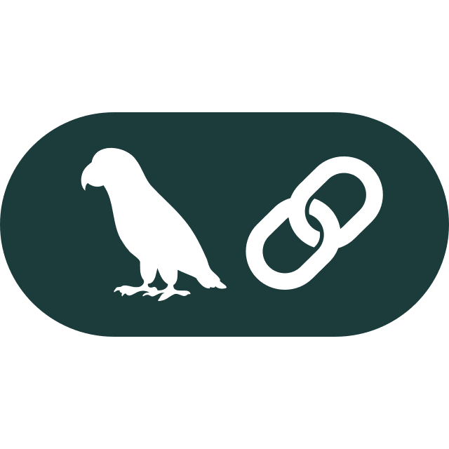

<h2>Hi there 👋</h2>

### 

I'm Volo, a lead software engineer.

Contacts: volod9646@gmail.com · [LinkedIn](https://www.linkedin.com/in/lopukhovych/)

### My tech stack:

<table align="center">
  <tr>
    <td align="center" width="112">
        
         Python
    </td>
    <td align="center" width="112">
        
         FastAPI
    </td>
    <td align="center" width="112">
        
         Django
    </td>
    <td align="center" width="112">
      
       Node.js
    </td>
    <td align="center"  width="112">
             
           NestJS
        </td>
    <td align="center" width="112">
        
       TypeScript
    </td>
    <td align="center" width="112">
         
       JavaScript
    </td>
    <td align="center" width="112">
        
       React.js
    </td>
<td align="center" width="112">
        
       Next.js
    </td>
  </tr>
<td align="center" width="112">
        
       AWS
    </td>
<td align="center" width="112">
        
       MongoDB
     </td>
<td align="center" width="112"> 
        
       PostgreSQL
    </td>
    <td align="center" width="112">
        
       Docker
     </td>
<td align="center" width="112">
        
       Redis
    </td>
    <td align="center"  width="112">
        
       Kafka
    </td>
    <td align="center" width="112">
        
       LangChain
     </td>
      <td align="center" width="112">
        
       LangGraph
    </td>
<td align="center" width="112">
        
       Github Action
    </td>
      </td>
</table>

## Connect with me

  

  

